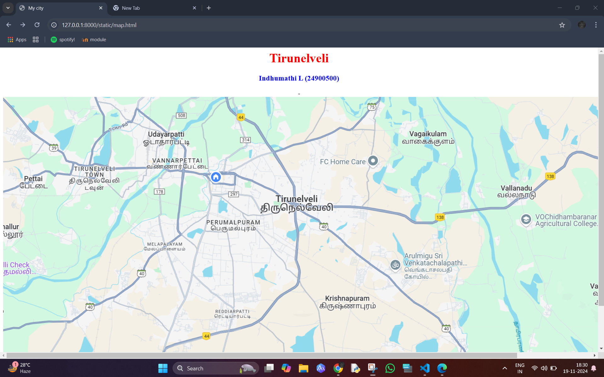
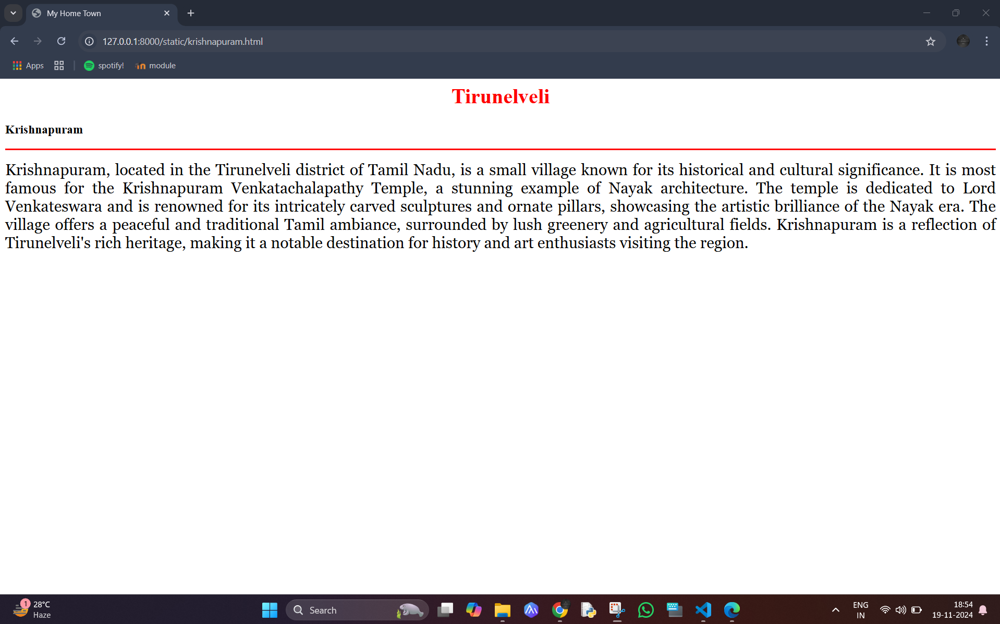
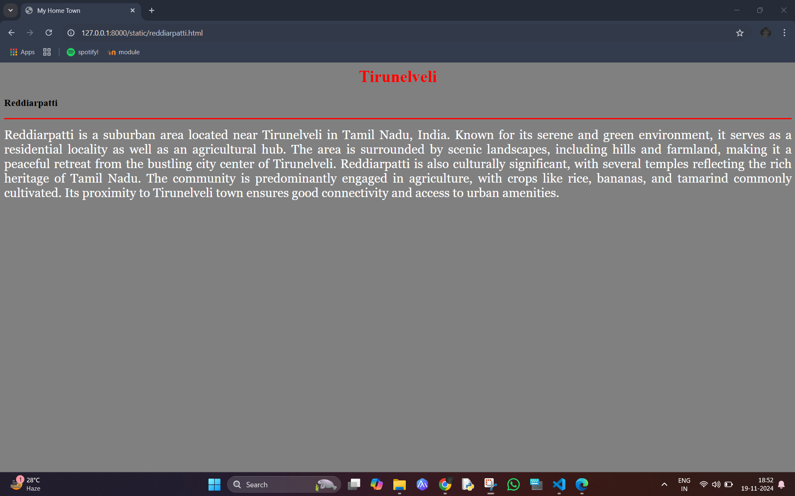
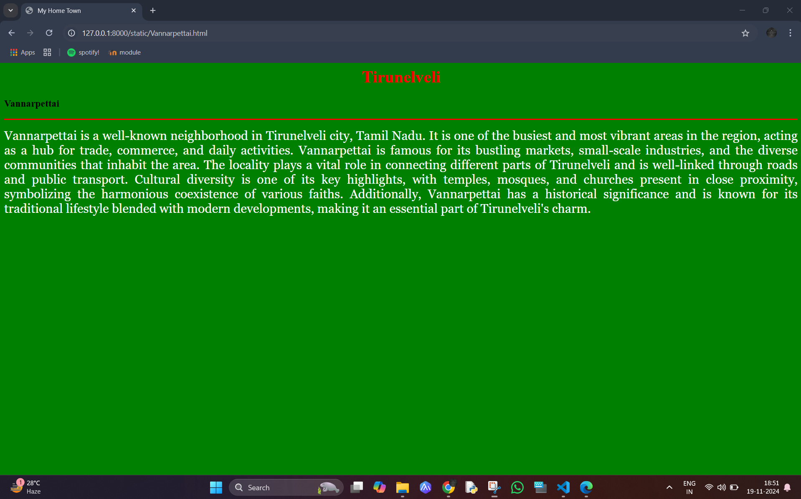
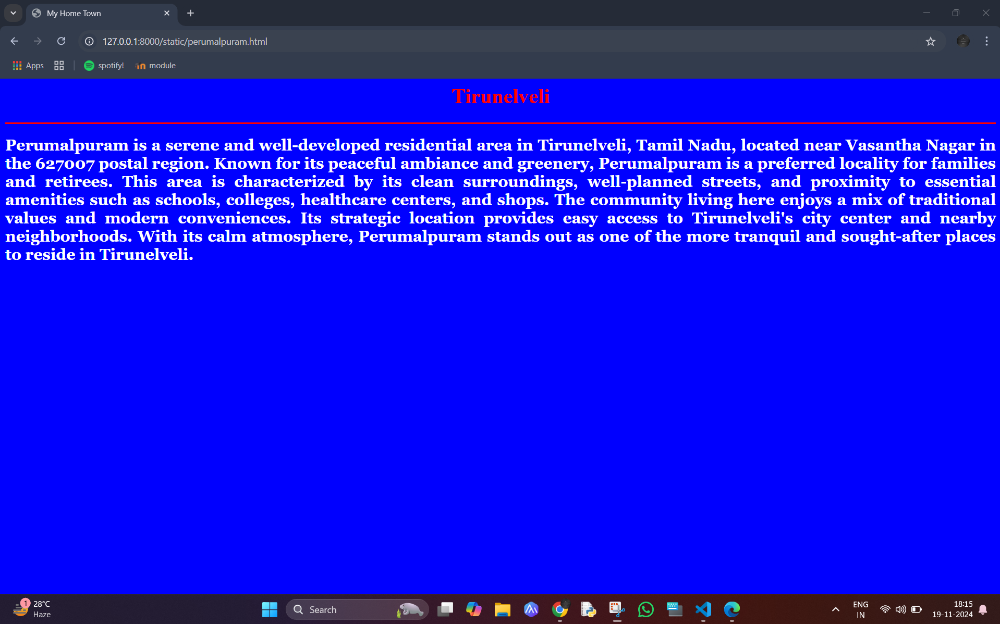
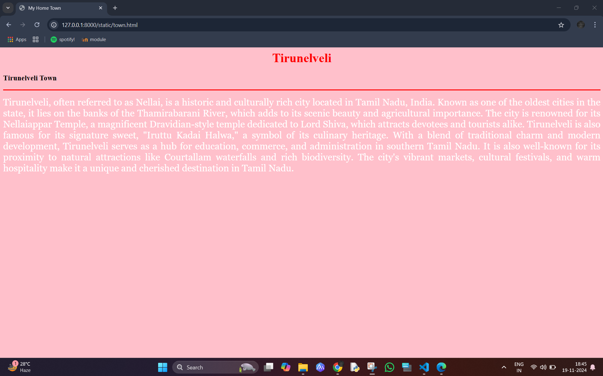

# Ex04 Places Around Me
## Date: 19-11-2024
## AIM
To develop a website to display details about the places around my house.

## DESIGN STEPS

### STEP 1
Create a Django admin interface.

### STEP 2
Download your city map from Google.

### STEP 3
Using ```<map>``` tag name the map.

### STEP 4
Create clickable regions in the image using ```<area>``` tag.

### STEP 5
Write HTML programs for all the regions identified.

### STEP 6
Execute the programs and publish them.

## CODE

map.html

```
<html>
<head>
<title>My city</title>
</head>
<body>
<h1 align="center">
<font color="red"><b>Tirunelveli</b></font>
</h1>
<h3 align="center">
<font color="blue"><b>Indhumathi L (24900500)</b></font>
</h3>
<center>
    -
    <map name="image-map">
        <area target="" alt="" title="" href="Vannarpettai.html" coords="367,136,526,193" shape="rect">
        <area target="" alt="" title="" href="krishnapuram.html" coords="787,479,977,562" shape="rect">
        <area target="" alt="" title="" href="perumalpuram.html" coords="582,314,86" shape="circle">
        <area target="" alt="" title="" href="town.html" coords="226,201,69" shape="circle">
        <area target="" alt="" title="" href="reddiarpatti.html" coords="512,521,654,588" shape="rect">
    </map>
</center>
</body>
</html>

krishnapuram.html

<html>
<head>
<title>My Home Town</title>
</head>
<body bgcolor="white">
    <h1 align="center">
    <font color="red"><b>Tirunelveli</b></font>
    </h1>
    <h3 align=""center">
        <font color="black"><b>Krishnapuram</b></font>
    </h3>
    <hr size="3" color="red">
    <p align="justify">
    <font face="Georgia" size="5" color="black">
        Krishnapuram, located in the Tirunelveli district of Tamil Nadu, is a small village known for its historical and cultural significance. It is most famous for the Krishnapuram Venkatachalapathy Temple, a stunning example of Nayak architecture. The temple is dedicated to Lord Venkateswara and is renowned for its intricately carved sculptures and ornate pillars, showcasing the artistic brilliance of the Nayak era.
The village offers a peaceful and traditional Tamil ambiance, surrounded by lush greenery and agricultural fields. Krishnapuram is a reflection of Tirunelveli's rich heritage, making it a notable destination for history and art enthusiasts visiting the region.
    </font>
    </p>
</body>
</html>

reddiarpettai.html

<html>
<head>
<title>My Home Town</title>
</head>
<body bgcolor="grey">
    <h1 align="center">
    <font color="red"><b>Tirunelveli</b></font>
    </h1>
    <h3 align=""center">
    <font color="black"><b>Reddiarpatti</b></font>
    </h3>
    <hr size="3" color="red">
    <p align="justify">
    <font face="Georgia" size="5" color="white">
        Reddiarpatti is a suburban area located near Tirunelveli in Tamil Nadu, India. Known for its serene and green environment, it serves as a residential locality as well as an agricultural hub. The area is surrounded by scenic landscapes, including hills and farmland, making it a peaceful retreat from the bustling city center of Tirunelveli.
Reddiarpatti is also culturally significant, with several temples reflecting the rich heritage of Tamil Nadu. The community is predominantly engaged in agriculture, with crops like rice, bananas, and tamarind commonly cultivated. Its proximity to Tirunelveli town ensures good connectivity and access to urban amenities.
    </font>
    </p>
</body>
</html>

vannarpettai.html

<html>
<head>
<title>My Home Town</title>
</head>
<body bgcolor="green">
    <h1 align="center">
    <font color="red"><b>Tirunelveli</b></font>
    </h1>
    <h3 align=""center">
        <font color="black"><b>Vannarpettai</b></font>
    </h3>
    <hr size="3" color="red">
    <p align="justify">
    <font face="Georgia" size="5" color="white">
        Vannarpettai is a well-known neighborhood in Tirunelveli city, Tamil Nadu. It is one of the busiest and most vibrant areas in the region, acting as a hub for trade, commerce, and daily activities. Vannarpettai is famous for its bustling markets, small-scale industries, and the diverse communities that inhabit the area. 
        The locality plays a vital role in connecting different parts of Tirunelveli and is well-linked through roads and public transport. Cultural diversity is one of its key highlights, with temples, mosques, and churches present in close proximity, symbolizing the harmonious coexistence of various faiths.  
        Additionally, Vannarpettai has a historical significance and is known for its traditional lifestyle blended with modern developments, making it an essential part of Tirunelveli's charm.
    </font>
    </p>
</body>
</html>

perumalpuram.html

<html>
<head>
<title>My Home Town</title>
</head>
<body bgcolor="blue">
    <h1 align="center">
    <font color="red"><b>Tirunelveli</b></font>
    </h1>
    <h3 align=""center">
        <font color="black"><b>Perumalpuram</b></font>
    </h3>
    <hr size="3" color="red">
    <p align="justify">
    <font face="Georgia" size="5" color="white">
        Perumalpuram is a serene and well-developed residential area in Tirunelveli, Tamil Nadu, located near Vasantha Nagar in the 627007 postal region. Known for its peaceful ambiance and greenery, Perumalpuram is a preferred locality for families and retirees. 
This area is characterized by its clean surroundings, well-planned streets, and proximity to essential amenities such as schools, colleges, healthcare centers, and shops. The community living here enjoys a mix of traditional values and modern conveniences. 
Its strategic location provides easy access to Tirunelveli's city center and nearby neighborhoods. With its calm atmosphere, Perumalpuram stands out as one of the more tranquil and sought-after places to reside in Tirunelveli.
    </font>
    </p>
</body>
</html>

town.html

<html>
<head>
<title>My Home Town</title>
</head>
<body bgcolor="pink">
    <h1 align="center">
    <font color="red"><b>Tirunelveli</b></font>
    </h1>
    <h3 align=""center">
        <font color="black"><b>Tirunelveli Town</b></font>
    </h3>
    <hr size="3" color="red">
    <p align="justify">
    <font face="Georgia" size="5" color="white">
Tirunelveli, often referred to as Nellai, is a historic and culturally rich city located in Tamil Nadu, India. Known as one of the oldest cities in the state, it lies on the banks of the Thamirabarani River, which adds to its scenic beauty and agricultural importance. 
The city is renowned for its Nellaiappar Temple, a magnificent Dravidian-style temple dedicated to Lord Shiva, which attracts devotees and tourists alike. Tirunelveli is also famous for its signature sweet, "Iruttu Kadai Halwa," a symbol of its culinary heritage.
With a blend of traditional charm and modern development, Tirunelveli serves as a hub for education, commerce, and administration in southern Tamil Nadu. It is also well-known for its proximity to natural attractions like Courtallam waterfalls and rich biodiversity. 
The city's vibrant markets, cultural festivals, and warm hospitality make it a unique and cherished destination in Tamil Nadu.
    </font>
    </p>
</body>
</html>
```

## OUTPUT













## RESULT
The program for implementing image maps using HTML is executed successfully.
